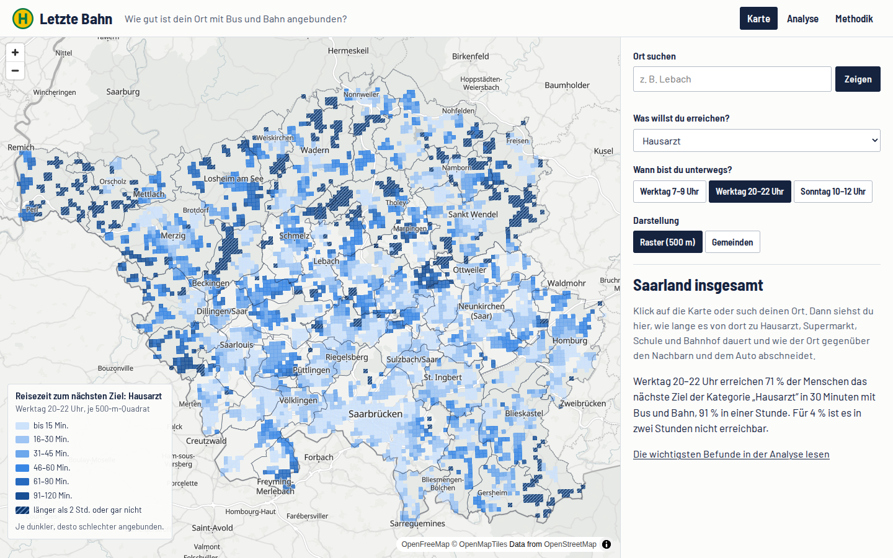
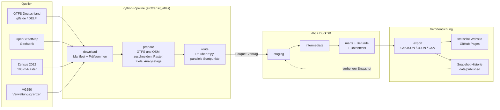

# Letzte Bahn – ÖPNV-Erreichbarkeitsatlas

**Wie viele Menschen und welche Ziele des Alltags erreiche ich von hier in 30, 45 und
60 Minuten mit Bus und Bahn – und wie steht mein Ort im Vergleich zu den Nachbarorten und
zum Auto da?** Der Atlas beantwortet das für jedes bewohnte 500-m-Quadrat und jede Gemeinde,
jeweils für einen Werktagmorgen, einen Werktagabend und einen Sonntag. Pilotgebiet ist das
Saarland; die Pipeline ist so gebaut, dass sie **auf ganz Deutschland skaliert** (siehe
[Skalierung auf ganz Deutschland](#skalierung-auf-ganz-deutschland)).

**Live:** https://tojacob03.github.io/Letzte-Bahn/



## Wichtigste Befunde

<!-- findings:start -->
_Stand `saarland_2026-09-26` · Fahrplantage 29.09.2026 (Werktag) und 04.10.2026 (Sonntag) · von der Pipeline geschrieben, bitte nicht von Hand ändern._

In 3 von 52 Gemeinden im Gebiet Saarland erreicht an einem Werktagabend (20:00–22:00 Uhr) weniger als die Hälfte der Einwohner eine Hausarztpraxis innerhalb von 60 Minuten mit Bus und Bahn. In 45 Minuten erreicht der mittlere Einwohner (Median) an einem Werktagmorgen 27.854 Menschen, an einem Sonntagvormittag nur 9.839 (65 % weniger). Zum nächsten Supermarkt braucht der mittlere Einwohner mit Bus und Bahn 3,7-mal so lange wie mit dem Auto; für 62 % der Einwohner dauert es mehr als dreimal so lange oder ist in zwei Stunden gar nicht möglich.
<!-- findings:end -->

Die Zahlen oben schreibt die Pipeline bei jedem Lauf neu; Diagramme dazu stehen auf der
[Analyseseite](https://tojacob03.github.io/Letzte-Bahn/analyse.html).

## Was gemessen wird

Für jedes bewohnte 500-m-Quadrat (Start am bevölkerungsgewichteten Schwerpunkt) und drei
Zeitfenster – werktags 7–9 Uhr, werktags 20–22 Uhr, sonntags 10–12 Uhr:

1. **Reisezeit zum nächsten Ziel** jeder Kategorie: Hausarzt, Apotheke, Supermarkt,
   Grundschule, weiterführende Schule, Krankenhaus, Bahnhof mit Regional- oder Fernverkehr.
2. **Erreichbare Bevölkerung** in 30/45/60 Minuten – als Ersatz für Arbeitsplätze, weil es
   offene Beschäftigtendaten auf einem so feinen Raster nicht gibt.
3. **ÖPNV im Vergleich zum Auto:** Verhältnis der Reisezeiten zu denselben Zielen.
4. **Abend- und Sonntagslücke:** dieselben Kennzahlen in allen drei Zeitfenstern.
5. **Veränderung zwischen Fahrplanständen**, sobald zwei Stände vorliegen.

Reisezeiten sind der **Median über jede Abfahrtsminute des Zeitfensters**, nicht eine
einzelne Abfahrt. Gemeindewerte sind bevölkerungsgewichtete Mediane und Anteile.

## Architektur



- **Python** übernimmt, was in SQL schlecht geht: den 2 GB großen bundesweiten Fahrplan
  direkt aus dem Zip-Archiv streamen, räumliche Verschneidungen, OSM-Auswertung und Routing.
  Es übergibt typisierte Parquet-Tabellen an dbt (`src/transit_atlas/staging.py` ist der
  Vertrag).
- **dbt auf DuckDB** modelliert alles Analytische: nächstes Ziel je Kategorie und
  Zeitfenster, erreichbare Bevölkerung, gewichtete Mediane, Nachbargemeinden (DuckDB
  spatial), Veränderung gegenüber dem vorherigen Snapshot und die Kernbefunde. Die
  [dbt-Dokumentation mit Lineage-Graph](https://tojacob03.github.io/Letzte-Bahn/dbt/)
  wird mit der Website veröffentlicht.
- **GitHub Actions** führt alles kostenlos aus: CI bei jedem Push, die komplette Pipeline
  zweimal im Monat und bei jeder Änderung am Pipeline-Code, danach Veröffentlichung von
  Daten und Website.

## Skalierung auf ganz Deutschland

Das Saarland ist das Pilotgebiet, nicht die Grenze des Projekts. Alle Eingangsdaten sind
bereits bundesweit: Der Fahrplan ist der Deutschland-Feed, Zensus-Raster und VG250 decken
ganz Deutschland ab, OpenStreetMap-Auszüge gibt es für jedes Bundesland. Ein Gebiet wird
allein über eine Konfigurationsdatei festgelegt:

- **Gebiet = Präfix des Amtlichen Gemeindeschlüssels.** `"10"` ist das Saarland, `"09"`
  Bayern, `"091"` der Regierungsbezirk Oberbayern, `"10046"` der Landkreis St. Wendel
  (so läuft der Smoke-Test). Bundesland, Regierungsbezirk und Kreis gehen ohne Codeänderung.
- **Neues Gebiet = neue YAML-Datei** in `config/` mit Gemeindeschlüssel-Präfix, den
  OSM-Auszügen des Landes und seiner Nachbarländer (für den 20-km-Puffer), dem Land für
  den Feiertagskalender (alle 16 Länder sind hinterlegt) und den Schulferien.
- **Ergebnisse lassen sich zusammenfügen:** Jede Gemeinde gehört zu genau einem Gebiet,
  Nachbargebiete dienen nur als Ziele im Puffer. Snapshots tragen das Gebiet im Namen
  (`saarland_2026-09-26`) und liegen nebeneinander in `data/published/snapshots/`.
- **Kostenlos bleibt es, wenn man aufteilt:** Der komplette Saarland-Lauf dauerte auf einem
  kostenlosen GitHub-Actions-Runner 62 Minuten; ein Job darf höchstens 6 Stunden laufen.
  Für ganz Deutschland läuft deshalb je Bundesland (große Länder je Regierungsbezirk) ein
  eigener Job in einer Actions-Matrix.

Noch nicht gebaut sind die Actions-Matrix und die Karte für das ganze Bundesgebiet: Die
Website lädt heute GeoJSON für ein Gebiet; für Deutschland wäre das zu groß und müsste als
Vektorkacheln (z. B. PMTiles auf GitHub Pages) ausgeliefert werden. Details in
[METHODOLOGY.md](METHODOLOGY.md#11-scaling-to-all-of-germany).

## Aufbau des Repositorys

```
config/        Laufkonfiguration (Pilotgebiet, Smoke-Test-Gebiet)
src/transit_atlas/   Python-Pipeline: download, prepare, route, transform, export
dbt/           dbt-Projekt: staging -> intermediate -> marts, Makros, Tests, Seeds
tests/         pytest: Unit-Tests und dbt-Build auf einem von Hand nachgerechneten Datensatz
web/           statische Website und erzeugte Daten in web/data
data/published/snapshots/   Kennzahlen jedes veröffentlichten Fahrplanstands
ops/           Skripte, die die GitHub-Workflows aufrufen
```

## Ausführen

In der Cloud (kostenlos): Jeder Push auf `main`, der `src/`, `dbt/`, `config/` oder `ops/`
ändert, startet die komplette Pipeline in GitHub Actions und veröffentlicht die Website neu;
Pushes auf andere Branches rechnen einen kleinen Smoke-Test (Landkreis St. Wendel). Die
Pipeline lässt sich auch von Hand starten: *Actions → Data pipeline → Run workflow*.

Lokal (braucht Python 3.12, Java 21, [uv](https://docs.astral.sh/uv/) und `osmium-tool`,
etwa 3 GB freien Speicherplatz):

```bash
uv sync
uv run pytest
uv run atlas run --config config/smoke.yaml     # kleines Gebiet, ca. 15 Minuten
uv run atlas run --config config/saarland.yaml  # Pilotgebiet
python3 -m http.server --directory web 8000     # dann http://localhost:8000 öffnen
```

Einzelne Schritte: `--steps download,prepare,route,transform,export`.

## Datenquellen

| Quelle | Lizenz |
| --- | --- |
| Fahrplan: GTFS Deutschland, DELFI e.V. über gtfs.de | CC BY 4.0 |
| Straßen, Wege, Ziele: © OpenStreetMap-Mitwirkende | ODbL 1.0 |
| Bevölkerung: Zensus 2022, © Statistische Ämter des Bundes und der Länder | dl-de/by-2-0 |
| Gemeindegrenzen: VG250, © BKG (2026) | dl-de/by-2-0 |
| Hintergrundkarte: OpenFreeMap, © OpenMapTiles, OpenStreetMap | frei, mit Namensnennung |

Lizenzprüfung, Pflichten und Abrufdaten: [DATA_SOURCES.md](DATA_SOURCES.md).

## Methodik und Grenzen

Alle Details in [METHODOLOGY.md](METHODOLOGY.md) (Englisch), eine Kurzfassung auf der
[Methodikseite](https://tojacob03.github.io/Letzte-Bahn/methodik.html). Die wichtigsten
Grenzen:

- nur Sollfahrplan – keine Echtzeitdaten, Verspätungen oder Ausfälle;
- Rufbusse fehlen oder sehen aus wie reguläre Fahrten;
- Öffnungszeiten werden nicht abgebildet – der Atlas misst die Verbindung, nicht ob die
  Praxis geöffnet hat;
- die Vollständigkeit von OpenStreetMap schwankt, besonders bei Arztpraxen;
- keine Bevölkerung und keine Ziele jenseits der französischen und luxemburgischen Grenze;
- Autozeiten ohne Stau und ohne Parkplatzsuche.

## Lizenzen

Code: [MIT](LICENSE). Veröffentlichte Daten (`web/data/`, `data/published/`): teilweise aus
OpenStreetMap abgeleitet und daher unter der [ODbL](DATA_LICENSE.md), mit den oben genannten
Namensnennungen.
