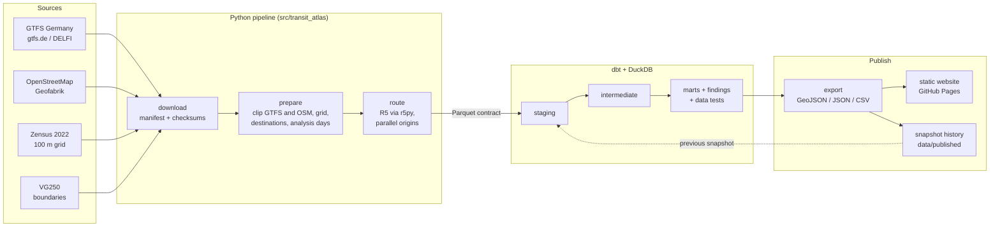

# Letzte Bahn – public transport accessibility atlas

**How many people and everyday destinations can I reach from here within 30, 45 and 60
minutes by bus and train – and how does my place compare with its neighbours and with the
car?** The atlas answers this for every inhabited 500 m square and every municipality of
the pilot region Saarland, on a weekday morning, a weekday evening and a Sunday.

**Live:** https://tojacob03.github.io/Letzte-Bahn/ (website in German)


## Key findings

<!-- findings:start -->
<!-- findings:end -->

The numbers above are written by the pipeline on every run; see the
[analysis page](https://tojacob03.github.io/Letzte-Bahn/analyse.html) for charts.

## What it measures

For every inhabited 500 m cell (routing starts at the population-weighted centre) and
three time windows – weekday 07–09, weekday 20–22, Sunday 10–12:

1. **Travel time to the nearest destination** of each category: family doctor, pharmacy,
   supermarket, primary school, secondary school, hospital, rail station with regional or
   long-distance trains.
2. **Reachable population** within 30/45/60 minutes, a stand-in for opportunities because
   open job data on a small grid does not exist.
3. **Public transport vs. car:** ratio of travel times to the same destinations.
4. **Evening and Sunday gap:** the same metrics in all three windows.
5. **Change between timetable snapshots**, as soon as two snapshots exist.

Travel times are the **median over every departure minute of the window**, not a single
departure. Municipal values are population-weighted medians and shares.

## Architecture



- **Python** does what SQL is bad at: streaming the 2 GB national timetable out of the zip
  without extracting it, spatial joins, OSM parsing and routing. It hands typed Parquet
  tables to dbt (`src/transit_atlas/staging.py` is the contract).
- **dbt on DuckDB** models everything analytical: nearest destination per category and
  window, reachable population, weighted medians, neighbours (DuckDB spatial), change
  against the previous snapshot and the headline findings. The
  [dbt documentation with lineage graph](https://tojacob03.github.io/Letzte-Bahn/dbt/)
  is published with the site.
- **GitHub Actions** runs everything for free: CI on every push, the full pipeline twice a
  month and on every change to the pipeline code, then publishes data and website.

## Repository layout

```
config/        run configuration (pilot region, smoke test region)
src/transit_atlas/   Python pipeline: download, prepare, route, transform, export
dbt/           dbt project: staging -> intermediate -> marts, macros, tests, seeds
tests/         pytest: unit tests and dbt build on a hand-checked fixture
web/           static website (German) and generated data in web/data
data/published/snapshots/   metrics of every published timetable snapshot
ops/           scripts called by the GitHub workflows
```

## How to run

In the cloud (no cost): every push to `main` that touches `src/`, `dbt/`, `config/` or
`ops/` runs the full pipeline in GitHub Actions and republishes the site; pushes to other
branches run a small smoke test (Landkreis St. Wendel). The pipeline can also be started
by hand under *Actions → Data pipeline → Run workflow*.

Locally (needs Python 3.12, Java 21, [uv](https://docs.astral.sh/uv/) and `osmium-tool`,
about 3 GB of free disk space):

```bash
uv sync
uv run pytest
uv run atlas run --config config/smoke.yaml     # small region, ~15 min
uv run atlas run --config config/saarland.yaml  # pilot region
python3 -m http.server --directory web 8000     # open http://localhost:8000
```

Single steps: `--steps download,prepare,route,transform,export`.

## Data sources

| Source | License |
| --- | --- |
| Timetable: GTFS Germany, DELFI e.V. via gtfs.de | CC BY 4.0 |
| Streets, paths, destinations: © OpenStreetMap contributors | ODbL 1.0 |
| Population: Zensus 2022, © Statistische Ämter des Bundes und der Länder | dl-de/by-2-0 |
| Municipal boundaries: VG250, © BKG (2026) | dl-de/by-2-0 |
| Background map: OpenFreeMap, © OpenMapTiles, OpenStreetMap | free, attribution |

License checks, obligations and retrieval dates: [DATA_SOURCES.md](DATA_SOURCES.md).

## Method and limitations

Full details in [METHODOLOGY.md](METHODOLOGY.md). The most important limitations:

- scheduled timetable only – no real-time data, delays or cancellations;
- on-demand buses (Rufbus) are missing or look like regular trips;
- opening hours are not modelled – the atlas measures the connection, not whether the
  practice is open;
- OpenStreetMap completeness varies, especially for doctors;
- no population or destinations across the French and Luxembourg borders;
- car times are free-flow without parking.

## Licenses

Code: [MIT](LICENSE). Published data (`web/data/`, `data/published/`): derived in part from
OpenStreetMap and therefore under the [ODbL](DATA_LICENSE.md), with the attributions above.
